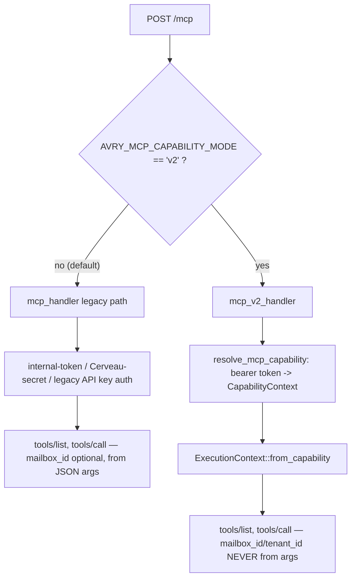

# MCP Architecture — Developer Reference

This document explains how the Model Context Protocol (MCP) surface in AVRY-Mail actually works: routing, the two parallel implementations, the capability/confirmation model, tool catalog, content safety, and current production status. It is a reference for anyone touching `crates/aivory-mail-api/src/mcp.rs` or the files it depends on.

For the historical design rationale and the acceptance gates that had to pass before any of this touched production, see [`MCP_PHASE_2_HANDOFF.md`](./MCP_PHASE_2_HANDOFF.md), [`PHASE_2_MCP_CAPABILITY_DESIGN.md`](./PHASE_2_MCP_CAPABILITY_DESIGN.md), and [`MCP_ISOLATION_CAPABILITY_CONTRACT.md`](./MCP_ISOLATION_CAPABILITY_CONTRACT.md). This document is the "how it works today" summary; those are the "why it was built this way" record.

## 1. The single entry point, two handlers

Every MCP request — from Cerveau, from a manually-issued agent capability, or from anything else — hits one HTTP route:

```
POST /mcp
```

registered in `crates/aivory-mail-api/src/api/mod.rs`. The handler function `mcp_handler` in `crates/aivory-mail-api/src/mcp.rs` immediately branches into one of two completely different code paths based on a single environment variable:

```rust
pub async fn mcp_handler(...) -> Result<Json<Value>, StatusCode> {
    if crate::api::execution_context::mcp_capability_mode_enabled() {
        return mcp_v2_handler(&state, &headers, body).await;
    }
    // ...legacy path continues here
}
```

`mcp_capability_mode_enabled()` (in `execution_context.rs`) checks:

```rust
std::env::var("AVRY_MCP_CAPABILITY_MODE").map(|v| v.trim() == "v2").unwrap_or(false)
```

**Fail-closed by default.** Unset, empty, or any value other than the literal string `v2` keeps the server on the legacy path. This is the single kill switch for the entire v2 surface — there is no partial-enable.



**As of this writing, `AVRY_MCP_CAPABILITY_MODE` is unset in production.** All live MCP traffic goes through the legacy path. v2 has been built, tested (unit + integration + a live staging stack + one production read-only canary), and is ready to enable, but enabling it permanently is a separate, deliberate decision — see §8.

## 2. The legacy path

This is what's actually serving traffic right now. Three ways in:

1. **Internal token** — header `x-internal-token` matching `state.config.internal_token` exactly.
2. **Cerveau secret** — header `x-cerveau-internal-secret` matching `state.config.cognee_secret`.
3. **API key** — `validate_api_key()` checks a bearer token / query key / `x-api-key` header against the `api_keys` table (SHA-256 hash comparison).

Once authenticated, `tools/call` dispatches by tool name. The important thing to understand: **`mailbox_id` is a JSON argument the caller supplies**, not something derived from an authenticated identity. Every data tool takes `mailbox_id` in its `arguments` object and scopes its query to it — *if present*. Several tools (notably `search_mail` in some call shapes, `get_inbox_overview`) fall back to an **unscoped, instance-wide query** when `mailbox_id` is absent, because that fallback is relied on for internal health checks. This is intentional but is exactly the kind of behavior v2 was built to eliminate — do not extend the legacy path's tool set, and do not remove the fallback without confirming nothing still depends on it.

The legacy path's SQL is hand-built per tool (not parameterized centrally); the folder/mailbox filtering for `search_mail` was fixed this session to use bound parameters instead of string interpolation (previously vulnerable to SQL injection via the `folder` argument). If you touch this handler, keep every value bound — don't reintroduce string formatting into a query.

## 3. The v2 path — capability-scoped, execution-context-isolated

v2 replaces "tell me which mailbox" with "prove you were granted access to exactly one mailbox, for exactly these operations, until this time." Three files carry the model:

### 3.1 Capability grants (`api/mcp_capabilities.rs`)

An admin (authenticated via normal JWT login, `authz::require_admin`) calls:

```
POST /v1/agent-access/grants
{
  "tenant_id": "...",
  "mailbox_id": "...",
  "caller_id": "some-agent-identifier",
  "audience": "aivory-mail-mcp",
  "scopes": ["mail.search", "mail.read"],
  "expires_in_seconds": 900
}
```

The server:
- Validates `mailbox_id` actually belongs to `tenant_id` (rejects otherwise — `FORBIDDEN`, never silently corrects it).
- Validates every scope against a fixed allowlist (`mail.read`, `mail.search`, `mail.thread.read`, `mail.knowledge.read`, `mail.attachment.read`, `mail.draft.create`, `mail.send`) — unknown scopes are rejected, not ignored.
- Generates a random 32-byte token (`avry_mcp_<base64>`), stores only its SHA-256 hash, and returns the raw token **once**, in the response body. It is never retrievable again.
- Caps lifetime at `MAX_LIFETIME_SECONDS` (1 hour); default is 15 minutes.

```
GET    /v1/agent-access/grants          — list all grants (audit trail — includes revoked ones)
DELETE /v1/agent-access/grants/:id      — revoke (sets revoked_at; does not delete the row)
```

Revocation is immediate: `resolve_mcp_capability` re-checks `revoked_at IS NULL` and `expires_at > now()` on every single request, so a revoked token stops working on its very next call — no cache, no grace period.

### 3.2 ExecutionContext (`api/execution_context.rs`)

Every v2 request builds an `ExecutionContext` **once**, from the validated capability, before any tool runs:

```rust
pub struct ExecutionContext {
    pub tenant_id: Uuid,
    pub mailbox_id: Uuid,
    pub caller_id: String,
    pub audience: String,
    pub scopes: Vec<String>,
    pub grant_id: Option<Uuid>,
    // + request_id / trace_id for logging correlation
}
```

This struct is **immutable** and **never constructed from request arguments**. Every DB query a v2 tool runs is filtered by `context.tenant_id` and `context.mailbox_id` bound directly from this struct — a model can put any `tenant_id`/`mailbox_id` it wants into its tool-call JSON and the server will silently ignore it, because the tools never read those fields from `args` in the first place. This is the core isolation property, and it's what the staging E2E test (`staging_mcp_e2e.rs`) and `sqlite_capability_isolation_rejects_adversarial_identity_and_credentials` (`phase2_mcp_isolation.rs`) exist to verify on every change.

`context.require_scope("mail.search")` is called at the top of every tool handler before it touches the database — missing the scope is `403 FORBIDDEN`, full stop.

### 3.3 Send confirmations (`api/mcp_confirmations.rs`)

`send_mail` is the one mutating v2 tool, and it cannot fire on a model's say-so alone:

```mermaid
sequenceDiagram
    participant Admin
    participant API as AVRY-Mail API
    participant Agent as MCP caller (model)

    Admin->>API: POST /v1/agent-access/send-confirmations (payload: from/to/subject/body)
    API-->>Admin: confirmation_id (bound to payload hash, tenant, mailbox, caller, expiry)
    Agent->>API: tools/call send_mail {..., confirmation_id}
    API->>API: consume_send_confirmation (atomic, one-time, payload hash must match exactly)
    alt payload changed since issuance
        API-->>Agent: 409 CONFLICT
    else confirmation valid, consumed
        API->>API: send_email_with_context (outbound transport)
        alt transport + persistence both succeed
            API-->>Agent: {"status":"succeeded","message_id":...}
        else anything fails after confirmation was consumed
            API-->>Agent: -32011 "send outcome is unknown; reconcile before retrying"
        end
    end
```

Two properties matter here:

1. **The confirmation is consumed *before* the outbound send is attempted**, not after. This means even if the send itself is ambiguous or fails, the confirmation can never be reused to fire a duplicate send — reconciliation is a human/ops decision, not an automatic retry.
2. **Any error after consumption maps to the same fixed "unknown, reconcile" response**, never the raw error text. The server does not claim "it failed" (the provider may have accepted it) and does not claim "it succeeded" (something after the transport call may have broken). See `sqlite_v2_send_reports_reconciliation_when_persistence_fails_after_dispatch` in `phase2_mcp_isolation.rs` for the test that pins this behavior — it models a provider-accepted send where the subsequent DB write fails, and asserts the conservative outcome.

### 3.4 Centralized limits (`mcp_limits.rs`)

Every bound on the v2 surface lives in one place — `McpLimits` — rather than being scattered per-handler: max request bytes, max query/folder/thread-id length, max search results, max thread budget, max recipients/attachments/body size, max serialized response size. Oversized or malformed input is rejected (`400`/`413`), never silently truncated or clamped. If you add a new v2 tool argument, add its bound here, not as a magic number in `mcp.rs`.

This file also owns `sanitize_for_ai` (see §5).

## 4. The v2 tool catalog

`mcp_v2_tools()` in `mcp.rs` is a **static, reviewed catalog** — not generated from route introspection — with MCP annotations (`readOnlyHint`, `destructiveHint`, `idempotentHint`, `openWorldHint`) that give clients a hint about blast radius. A test (`v2_catalog_is_static_scoped_and_annotated`) pins its shape and asserts the catalog never leaks `mailbox_id`/`tenant_id`/`api_key` as an argument name — those come from the capability, not the call.

| Tool | Required scope | Reads/writes | Notes |
|---|---|---|---|
| `search_mail` | `mail.search` | subject/from, ILIKE match | Bound to `context.tenant_id`/`mailbox_id`; results sanitized (§5) |
| `get_inbox_overview` | `mail.read` | total + unread counts | No arguments |
| `get_thread_memory` | `mail.thread.read` | subject/snippet/body_text, budget-truncated | `thread_id` required; content sanitized |
| `get_knowledge_compile` | `mail.knowledge.read` | multi-folder digest + threads, cached 30s per (tenant, mailbox, budget, scopes) key | Delegates to `api/knowledge.rs::compile_for_context` |
| `send_mail` | `mail.send` | outbound send | Requires `confirmation_id`; see §3.3 |

There is deliberately **no capability-management tool and no mailbox-selection tool** in this catalog — a model cannot issue, list, or revoke its own grants, and cannot pick which mailbox it talks to. That has to happen through the admin-authenticated `/v1/agent-access/*` routes, which are a completely separate trust boundary.

## 5. Content sanitization — prompt-injection defense

Email is untrusted input. Before subject/snippet/body text from `search_mail`, `get_thread_memory`, or `get_knowledge_compile` reaches an MCP result — which an assistant (Cerveau) will read as context — it passes through `mcp_limits::sanitize_for_ai`:

```rust
pub fn sanitize_for_ai(text: &str) -> String {
    text.chars().filter(|c| !matches!(*c,
        '\u{200B}'..='\u{200D}' | '\u{2060}' | '\u{FEFF}' | '\u{202A}'..='\u{202E}' | '\u{2066}'..='\u{2069}'
    )).collect()
}
```

This strips zero-width spaces/joiners, the byte-order mark, and bidirectional-override control characters — the character classes a sender can use to hide text from a human reading the rendered email while an LLM still reads the raw string. **This does not filter visible adversarial phrasing** ("ignore previous instructions" typed in plain text is untouched) — defending against that is the assistant orchestration layer's job (treating retrieved content as data, not instructions), which is tracked as a separate, not-yet-implemented item in [`MCP_EXTERNAL_PATTERNS_ADAPTATION_MATRIX.md`](./MCP_EXTERNAL_PATTERNS_ADAPTATION_MATRIX.md).

## 6. Outbound logging discipline

Transport logs (`mail/outbound.rs`) intentionally carry **no** email addresses, subjects, bodies, or raw provider response text — only provider name, recipient counts, and accepted/failed status. If you add a new outbound transport or touch an existing one, keep it that way; don't log `req.to`, `req.subject`, or a provider's raw response body.

## 7. File map

```
crates/aivory-mail-api/src/
├── mcp.rs                        # single /mcp route: legacy handler + mcp_v2_handler + static tool catalog
├── mcp_limits.rs                 # centralized bounds, arg validation, sanitize_for_ai
├── api/
│   ├── execution_context.rs      # ExecutionContext, mcp_capability_mode_enabled(), resolve_user_context (non-MCP JWT path)
│   ├── mcp_capabilities.rs       # grant issuance/validation/revocation, scope allowlist
│   ├── mcp_confirmations.rs      # send confirmation issuance/consumption
│   ├── agent_access.rs           # admin HTTP routes for the above (/v1/agent-access/*)
│   └── knowledge.rs              # compile_for_context (v2) vs compile (legacy user route)
└── mail/outbound.rs               # send_email / send_email_with_context, transport fallback chain

crates/aivory-mail-api/tests/
├── phase2_mcp_isolation.rs       # SQLite unit/integration tests + opt-in Postgres parity test
└── staging_mcp_e2e.rs            # opt-in live HTTP test against an isolated staging stack

migrations/
├── 025_mcp_capability_grants.sql
└── 029_mcp_send_confirmations.sql

docs/
├── MCP_PHASE_2_HANDOFF.md                       # status handoff / acceptance gates
├── PHASE_2_MCP_CAPABILITY_DESIGN.md             # original design doc
├── MCP_ISOLATION_CAPABILITY_CONTRACT.md         # isolation invariants
├── MCP_EXTERNAL_PATTERNS_ADAPTATION_MATRIX.md   # what was adapted from external projects and why
└── STAGING_MCP_E2E.md                           # staging setup + the production canary runbook
```

## 8. Current production status (as of 2026-09-13)

- Production `avry-mail` is running the latest committed code (includes all Phase 2 MCP files, the SQL-injection fix in the legacy handler, the log-redaction fixes, and the content sanitizer).
- Migrations 018–029 are fully applied (`_sqlx_migrations` ledger verified).
- `AVRY_MCP_CAPABILITY_MODE` is **unset** — v2 is dormant. All live traffic uses the legacy handler.
- A full 9-step controlled canary (documented in `STAGING_MCP_E2E.md`) was executed against production on 2026-09-12: pre-flight migration check → backup+checksum → toggle v2 on → one real capability grant issued for the admin's own mailbox → `get_inbox_overview` called successfully → invalid and revoked tokens correctly rejected with `401` → grant revoked → toggle reverted. Production was returned to its exact starting state (v2 disabled) afterward.
- A live isolated staging stack (`avry-mail-staging` + `avry-postgres-staging` on the same VPS, `AVRY_MCP_CAPABILITY_MODE=v2` permanently on) exists for regression-testing v2 changes without touching production. Run `staging_mcp_e2e.rs` against it before changing anything in the v2 path.

### What is *not* yet true, and must not be assumed

- **Broad `ExecutionContext` coverage is not complete.** Realtime WebSocket subscriptions, attachment references/downloads, the legacy (`compile`, non-`_for_context`) knowledge path, cache keys, and every outbound sender-identity path have not all been individually audited for context-awareness. Do not assume a new feature is isolated just because it lives near code that is.
- **The legacy `/mcp` handler is still live and still has the "fall back to unscoped query when `mailbox_id` is absent" behavior** described in §2. It is out of v2's scope by design, not an oversight, but it means the legacy path remains the weaker isolation boundary as long as it's reachable.
- **No attachment tools exist in the v2 catalog.** Don't add one without a dedicated authorization/size/MIME review — this was explicitly deferred, not forgotten.
- **Prompt hardening at the assistant/orchestration layer (Cerveau) is not implemented.** §5's sanitizer closes the invisible-character smuggling vector only; visible-instruction injection defense is still open.
- Enabling `AVRY_MCP_CAPABILITY_MODE=v2` **permanently** in production is a separate decision from everything above being ready — it was deliberately not done as part of landing this code, and should go through the same canary discipline (§ above) with someone actively watching, not as an unattended step.
